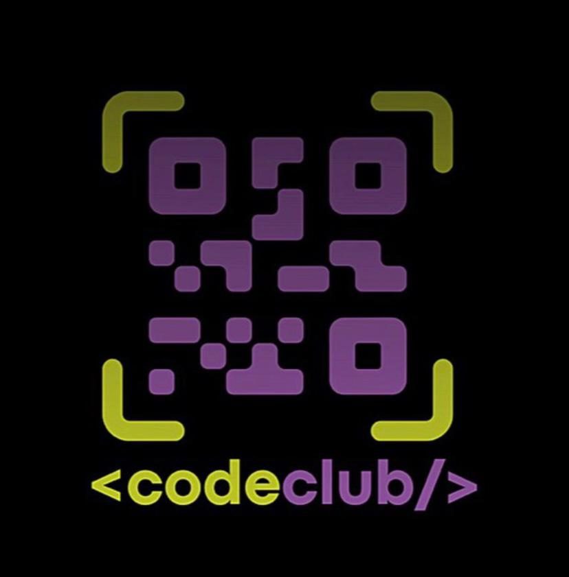

# `Yoga-Interface`

<code></code>

  

2º Desafio-CSS do Curso CodeClub
 

Trainer/Founder: <i>Rodolfo Mori</I>

  

#

<b>>>>>>By<<<<<</b>

<table align="right">
  <tr>
    <td align="center">
      <a href="https://github.com/MeireCeschim">
         
        
          <b>MeireCeschim</b>
        
      </a>
    </td>
  </tr>
</table>
    

📌 `Tarefas executadas:`
- [x] Criação HTML
- [x] Estilo em CSS
 

⚠ `PROJETO EM CONSTRUÇÃO`

 

## `Tech`

<b>❤TECHNOLOGY❤</b>
 

 
